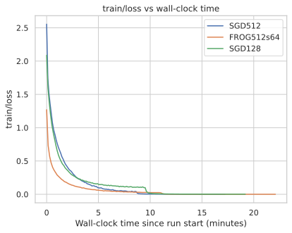
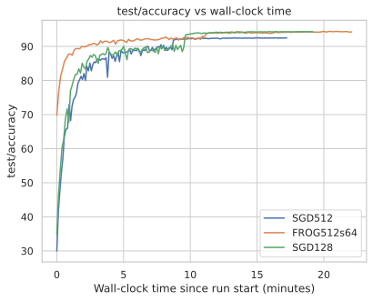

# FROG Optimizer

FROG (Fisher ROw-wise preconditioninG) is a K-FAC inspired optimizer with several structural modifications aimed at making second-order preconditioning practical and stable.

## Motivation

This optimizer is motivated by the following observations:

- Scale-invariance is a desirable property for the optimizer, as in Adam or RMSProp. Newtonian methods are not scale invariant and have scale as inverse gradient.

- At the later stages of training, decoupling X and Y seems to hurt performance.

- Y^T Y typically exhibits strong diagonal dominance. This suggests that Fisher may be close to block-diagonal w.r.t rows, making it effective to precondition rows (output channels) independently without huge loss in performance.

- Exact empirical Fisher construction is prohibitively expensive. So, subsampling and batched CG is used.

## Key modifications

- No decoupling of Fisher into kronecker product, as in K-FAC.

- Row-wise separation: each row has its own Fisher matrix.

- Rescaling Fisher by tr(F)/D (average diagonal value) to achieve scale-invariance.   

- Iterative CG on row-wise Fishers

- Subsampled activations
  Fisher matvecs are computed using a random subset of activations, significantly reducing computational cost.

## Wall-clock Efficiency (CIFAR-10)

All experiments were conducted on NVIDIA A100 (80 GB) using the CIFAR-10 dataset and the ResNet-18 model.  
Reported values correspond to wall-clock time (in minutes) required to first reach a given test accuracy.

The learning-rate schedule follows the setup from  
https://github.com/hirotomusiker/cifar10_pytorch/:  
a constant learning rate with 10× drops at epochs 80 and 120.
### Time to Reach Target Test Accuracy

| Optimizer | Batch Size (bs) | Sample Size (s) | 88% (min) | 90% (min) | 92% (min) | 94% (min) |
|-----------|----------------:|----------------:|----------:|----------:|----------:|----------:|
| FROG      | 512 | 64 | **1.29** | **1.86** | **5.37** | 11.88 |
| SGD       | 128 | – | 3.82 | 5.01 | 9.63 | **11.44** |
| SGD       | 512 | – | 3.91 | 7.80 | 8.84 | – |

### Training Dynamics (CIFAR-10)

  
  

### Interpretation

- FROG reaches 88–92% test accuracy between ~1.6× and ~4.2× faster in wall-clock time compared to SGD baselines.
- Final accuracy is comparable across methods; the main benefit is faster time-to-solution, especially in early and mid-training.

## Legacy version: K-FROG (Kronecker FROG)
I kept the previous optimizer, which performs kronecker-based factoring, same as in K-FAC and uses CG on XX^T, while performing inverse sqrt on YY^T.

## TODO

- Add support for linear layers and biases.
- Add mixed precision support
- Compare FROG with other optimizers on convolutional architectures.
